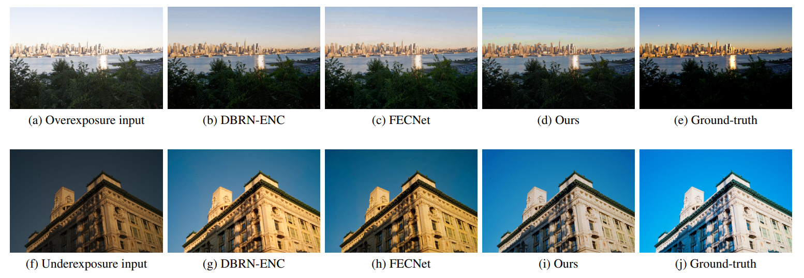
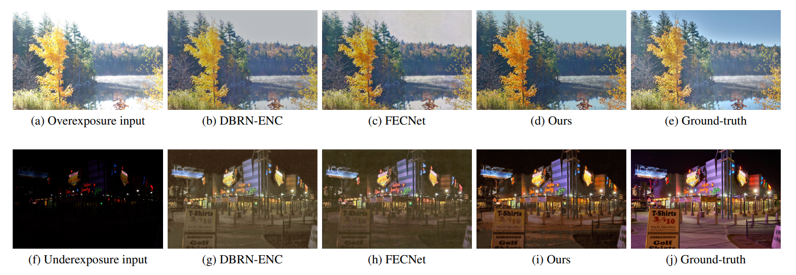
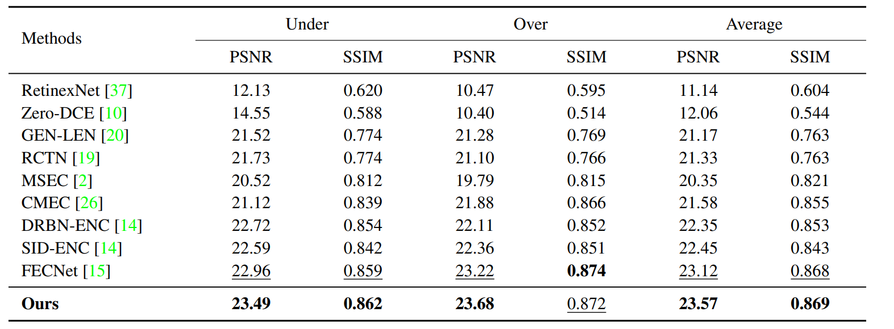

# LACT : Luminance-aware Color Transform for Multiple Exposure Correction

## Introduction
This repo is the official Code of  Luminance-aware Color Transform for Multiple Exposure Correction (**ICCV 2023**). 

## Qualitative Result on ME Dataset


## Qualitative Result on SICE Dataset


## Installation

### Requirements
- Linux or macOS with Python ≥ 3.6
- tensorflow ≥ 2.5 and [torchvision](https://github.com/pytorch/vision/) that matches the PyTorch 
- OpenCV is optional but needed by demo and visualization
- scikit-learn is need to save image file

### Example conda environment setup
```bash
conda create --name lact python=3.8 -y
conda activate lact
conda install tensorflow==2.5.0
pip install -U opencv-python

# Prepare Datasets for LACT

$DATASETS/
  multi_exposure/
  SICE/
```

## Expected dataset structure for [multi_exposure](https://github.com/mahmoudnafifi/Exposure_Correction):

```
multi_exposure/
  testing/
  traiing/
  multi_adobe5k-train.json
  multi_adobe5k-test.json
```

## Expected dataset structure for SICE:
```
cityscapes/
  sice_middle/
  sice_middle_label/
  sice_middle_train.json
  sice_middle_test.json
```
## Getting Started with LACT

### Develop Environment
OS: Ubuntu 18.04

GPU: Nvidia RTX A6000

### Train
```python -m train.py --dataset dataset_path --train_db dataset_path/train.json```</br>
```                   --test_db dataset_path/test.json --batch_size = 2```</br>
```                   --epochs 20 --learning_rate = 3e-4```</br>
```                   --warmup_steps 8765 decay_steps = 40000 --log_dir result/```</br>

### Structure of Project Folder
```
$ tree

├─datasets
├─libs
│  ├─Metric.py
│  ├─model.py
│  ├─multi_datasets.py
│  ├─util.py
├─logs
└─train.py
```

### Result
We achieved the state-of-the art on ME Dastset and SICE Dataset.


